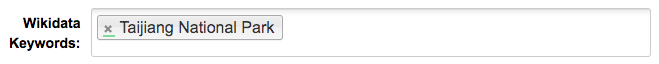
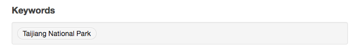

=======================
ckanext-wikidatakeyword
=======================

This extension adds Wikidata-powered keyword field in CKAN datasets.

This new extra field "Wikidata Keywords" will appear in the
dataset form by the `form snippet`_.

When displayed, each keyword will appear by the
`display snippet`_, eg.:

------------
Requirements
------------

This extension is only tested in CKAN 2.9 and later with ckanext-scheming installed.

------------
Installation
------------

To install ckanext-wikidatakeyword:

1. Activate your CKAN virtual environment, for example::

    . /usr/lib/ckan/default/bin/activate

2. Install the ckanext-wikidatakeyword Python package into your virtual environment::

    pip install -e 'git+https://github.com/depositar/ckanext-wikidatakeyword.git#egg=ckanext-wikidatakeyword'

3. Install Python dependencies::

    pip install -r /usr/lib/ckan/default/src/ckanext-wikidatakeyword/requirements.txt

4. Add ``wikidatakeyword`` and ``scheming_datasets`` to the ``ckan.plugins`` setting in your CKAN
   config file (by default the config file is located at
   ``/etc/ckan/default/production.ini``).

5. Add ``ckanext.wikidatakeyword:presets.json`` to your scheming.presets
   configuration settings::

    scheming.presets = ckanext.scheming:presets.json
                       ckanext.wikidatakeyword:presets.json

6. A keyword field in a scheming schema will look something like
   (``/usr/lib/ckan/default/src/ckanext-scheming/ckanext/scheming/ckan_dataset.yaml`` if
   you are not using a custom extension)::

   - field_name: keywords
     label: Wikidata Keywords
     preset: wikidata_keyword

7. Add a file ``templates/scheming/package/read.html`` in your custom extension
   (or modify ``/usr/lib/ckan/default/src/ckanext-scheming/ckanext/scheming/templates/scheming/package/read.html`` if
   you are not using a custom extension)::

    

    
      
        
      
      {{ super() }}
    

8. Add a file ``templates/scheming/package/snippets/additional_info.html`` in your custom extension
   (or modify ``/usr/lib/ckan/default/src/ckanext-scheming/ckanext/scheming/templates/scheming/package/snippets/additional_info.html``
   if you are not using a custom extension)::

    

    
      
      {{ super() }}
    

9. Add the new field in your CKAN Solr schema file
   (by default the config file is located at
   ``/usr/lib/ckan/default/src/ckan/ckan/config/solr/schema.xml``)
   between the ``<fields>`` tag::

    <field name="keywords_facet" type="string" indexed="true" stored="true" multiValued="true"/>

10. Restart CKAN and Solr. For example if you've deployed CKAN with Apache on Ubuntu::

     sudo service jetty8 restart
     sudo service apache2 reload

.. _form snippet: ckanext/wikidatakeyword/templates/scheming/form_snippets/wikidata_keyword.html
.. _display snippet: ckanext/wikidatakeyword/templates/wikidatakeyword/snippets/wikidatakeyword_list.html
